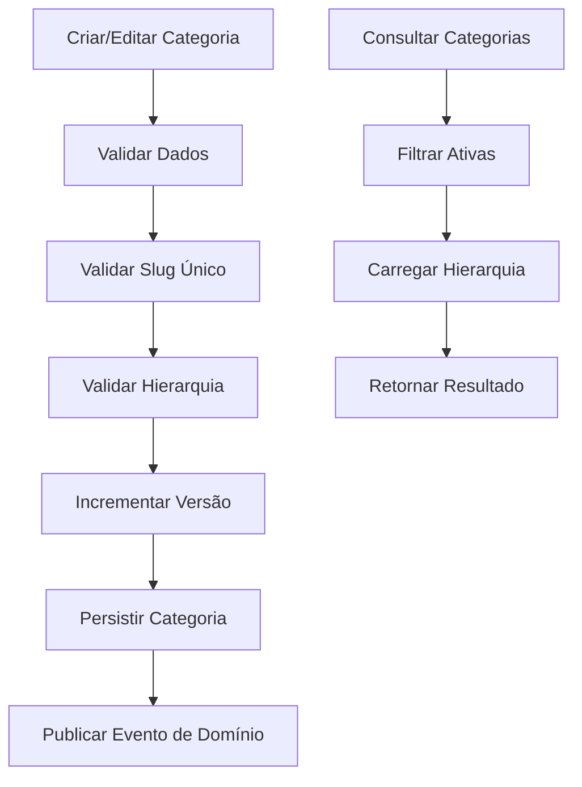

# Documento de Requisitos - Entidade Category

## 1. Visão Geral do Produto

Sistema de gerenciamento de categorias para e-commerce com suporte a hierarquia multinível, metadados flexíveis e controle de versão. A entidade Category serve como aggregate root para organização de produtos em uma estrutura hierárquica, permitindo categorização eficiente e navegação intuitiva.

O sistema resolve problemas de organização de catálogo de produtos, oferecendo flexibilidade para estruturas de categorias complexas e será utilizado por administradores do sistema e consumido por APIs de frontend.

## 2. Funcionalidades Principais

### 2.1 Papéis de Usuário

| Papel | Método de Registro | Permissões Principais |
|-------|-------------------|----------------------|
| Administrador | Acesso via sistema interno | Criar, editar, ativar/desativar categorias, gerenciar hierarquia |
| Sistema API | Integração via serviços | Consultar categorias ativas, navegar hierarquia |

### 2.2 Módulo de Funcionalidades

O sistema de categorias consiste nas seguintes funcionalidades principais:

1. **Gerenciamento de Categorias**: criação, edição, ativação/desativação de categorias
2. **Hierarquia de Categorias**: suporte a categorias pai/filho com múltiplos níveis
3. **Controle de Metadados**: armazenamento flexível de informações adicionais
4. **Controle de Versão**: versionamento automático para auditoria
5. **Validação de Domínio**: garantia de integridade dos dados e regras de negócio

### 2.3 Detalhes das Funcionalidades

| Módulo | Funcionalidade | Descrição |
|--------|---------------|-----------|
| Gerenciamento | Criar Categoria | Criar nova categoria com nome, slug único, descrição opcional e metadados |
| Gerenciamento | Editar Categoria | Atualizar informações da categoria com incremento automático de versão |
| Gerenciamento | Ativar/Desativar | Controlar visibilidade da categoria sem exclusão física |
| Hierarquia | Definir Categoria Pai | Estabelecer relação hierárquica entre categorias |
| Hierarquia | Reordenar Categorias | Definir ordem de exibição através do campo display_order |
| Hierarquia | Validar Hierarquia | Prevenir referências circulares e hierarquias inválidas |
| Metadados | Gerenciar Metadados | Armazenar informações adicionais em formato JSON flexível |
| Controle | Versionamento | Incremento automático de versão a cada alteração |
| Controle | Auditoria | Rastreamento de created_at e updated_at |

## 3. Processo Principal

### Fluxo de Gerenciamento de Categorias

O administrador acessa o sistema de gerenciamento, cria ou edita categorias definindo nome, slug, descrição e categoria pai (se aplicável). O sistema valida as regras de domínio, gera slug único se necessário, e persiste a categoria com versionamento automático.

### Fluxo de Consulta de Categorias

As APIs do sistema consultam categorias ativas, navegam pela hierarquia para exibição em interfaces de usuário, e utilizam metadados para funcionalidades específicas como filtros e configurações de exibição.

## 4. Design da Interface

### 4.1 Estilo de Design

- **Cores Primárias**: Azul corporativo (#2563eb), Verde sucesso (#16a34a)
- **Cores Secundárias**: Cinza neutro (#6b7280), Vermelho erro (#dc2626)
- **Estilo de Botões**: Arredondados com sombra sutil
- **Fonte**: Inter, tamanhos 14px (corpo), 16px (títulos), 12px (labels)
- **Layout**: Card-based com navegação lateral para hierarquia
- **Ícones**: Lucide icons para consistência visual

### 4.2 Visão Geral do Design

| Módulo | Componente | Elementos de UI |
|--------|------------|-----------------|
| Lista de Categorias | Árvore Hierárquica | TreeView com expansão/colapso, indicadores de status ativo/inativo, badges para contagem de subcategorias |
| Formulário de Categoria | Editor de Categoria | Campos de texto para nome/descrição, seletor de categoria pai, toggle para status ativo, editor JSON para metadados |
| Validação | Feedback Visual | Mensagens de erro inline, indicadores de validação em tempo real, confirmações de sucesso |

### 4.3 Responsividade

Interface desktop-first com adaptação para tablets. Navegação hierárquica otimizada para telas maiores, com versão colapsável para dispositivos menores. Formulários responsivos com validação em tempo real.