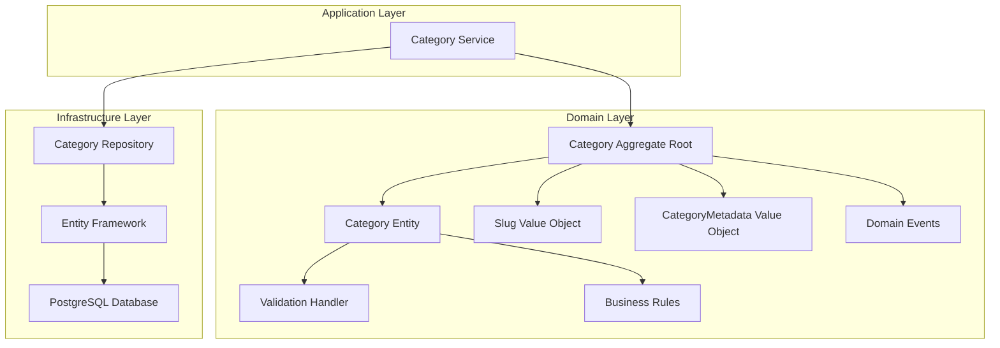
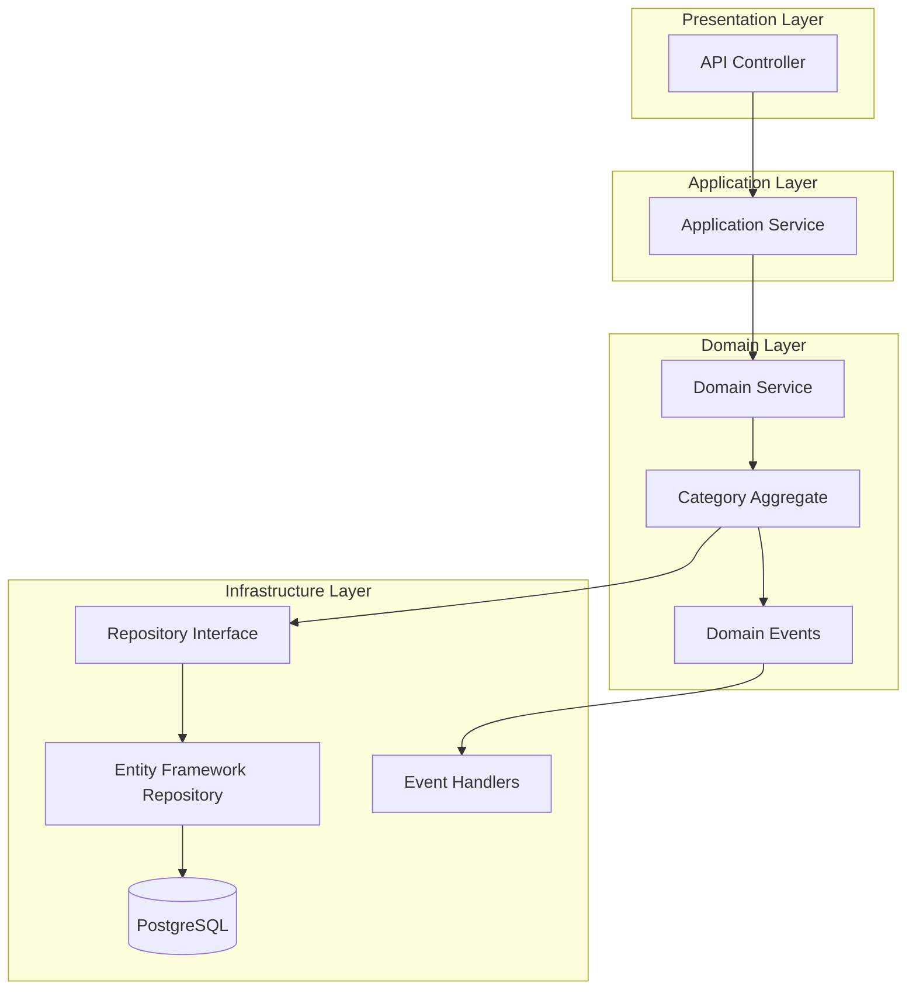
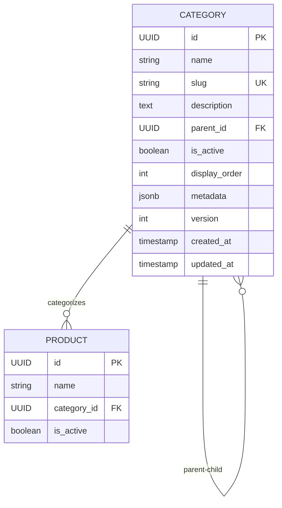

# Arquitetura Técnica - Entidade Category

## 1. Design da Arquitetura



## 2. Descrição das Tecnologias

- Frontend: React@18 + tailwindcss@3 + vite
- Backend: .NET 8 + Entity Framework Core
- Database: PostgreSQL (via Supabase)
- Patterns: DDD, CQRS, Repository Pattern

## 3. Definições de Rotas

| Rota | Propósito |
|------|-----------|
| /admin/categories | Página de gerenciamento de categorias |
| /admin/categories/new | Formulário de criação de categoria |
| /admin/categories/{id}/edit | Formulário de edição de categoria |
| /api/categories | Listagem de categorias ativas |
| /api/categories/{id} | Detalhes de uma categoria específica |
| /api/categories/hierarchy | Estrutura hierárquica completa |

## 4. Definições de API

### 4.1 Core API

**Criar Categoria**
```
POST /api/categories
```

Request:
| Param Name | Param Type | isRequired | Description |
|------------|------------|------------|-------------|
| name | string | true | Nome da categoria (máx 100 chars) |
| slug | string | false | Slug único (gerado automaticamente se não fornecido) |
| description | string | false | Descrição da categoria |
| parentId | UUID | false | ID da categoria pai |
| isActive | boolean | false | Status ativo (padrão: true) |
| displayOrder | int | false | Ordem de exibição (padrão: 0) |
| metadata | object | false | Metadados adicionais em JSON |

Response:
| Param Name | Param Type | Description |
|------------|------------|-------------|
| id | UUID | ID da categoria criada |
| name | string | Nome da categoria |
| slug | string | Slug único gerado |
| version | int | Versão inicial (1) |
| createdAt | DateTime | Data de criação |

**Atualizar Categoria**
```
PUT /api/categories/{id}
```

Request:
| Param Name | Param Type | isRequired | Description |
|------------|------------|------------|-------------|
| name | string | true | Nome atualizado da categoria |
| description | string | false | Descrição atualizada |
| parentId | UUID | false | Nova categoria pai |
| isActive | boolean | false | Status ativo |
| displayOrder | int | false | Nova ordem de exibição |
| metadata | object | false | Metadados atualizados |

**Listar Categorias**
```
GET /api/categories
```

Query Parameters:
| Param Name | Param Type | isRequired | Description |
|------------|------------|------------|-------------|
| includeInactive | boolean | false | Incluir categorias inativas |
| parentId | UUID | false | Filtrar por categoria pai |
| page | int | false | Número da página |
| pageSize | int | false | Tamanho da página |

## 5. Arquitetura do Servidor



## 6. Modelo de Dados

### 6.1 Definição do Modelo de Dados



### 6.2 Linguagem de Definição de Dados

**Tabela Categories**
```sql
-- Tabela já existe no schema, mas aqui estão as definições principais
CREATE TABLE categories (
    id UUID PRIMARY KEY DEFAULT uuid_generate_v4(),
    name VARCHAR(100) NOT NULL,
    slug VARCHAR(120) UNIQUE NOT NULL,
    description TEXT,
    parent_id UUID REFERENCES categories(id) ON DELETE SET NULL,
    is_active BOOLEAN DEFAULT TRUE,
    display_order INT DEFAULT 0,
    metadata JSONB DEFAULT '{}',
    version INT DEFAULT 1,
    created_at TIMESTAMP DEFAULT now(),
    updated_at TIMESTAMP DEFAULT now()
);

-- Índices para performance
CREATE INDEX idx_categories_slug ON categories(slug);
CREATE INDEX idx_categories_parent_id ON categories(parent_id);
CREATE INDEX idx_categories_active ON categories(is_active);
CREATE INDEX idx_categories_display_order ON categories(display_order);

-- Trigger para updated_at
CREATE TRIGGER update_categories_updated_at 
    BEFORE UPDATE ON categories 
    FOR EACH ROW EXECUTE FUNCTION update_updated_at_column();

-- Dados iniciais de exemplo
INSERT INTO categories (name, slug, description, is_active, display_order) VALUES
('Eletrônicos', 'eletronicos', 'Categoria principal para produtos eletrônicos', true, 1),
('Roupas', 'roupas', 'Categoria principal para vestuário', true, 2),
('Casa e Jardim', 'casa-jardim', 'Produtos para casa e jardim', true, 3);

-- Subcategorias
INSERT INTO categories (name, slug, description, parent_id, is_active, display_order) VALUES
('Smartphones', 'smartphones', 'Telefones celulares e acessórios', 
 (SELECT id FROM categories WHERE slug = 'eletronicos'), true, 1),
('Laptops', 'laptops', 'Computadores portáteis', 
 (SELECT id FROM categories WHERE slug = 'eletronicos'), true, 2);
```

**Implementação da Entidade Category (Domain)**
```csharp
// Category.cs - Aggregate Root
using BuildingBlocks.Core.Domain;
using BuildingBlocks.Core.Validations;

namespace CatalogService.Domain.Categories;

public class Category : AggragteRoot
{
    public string Name { get; private set; }
    public Slug Slug { get; private set; }
    public string? Description { get; private set; }
    public Guid? ParentId { get; private set; }
    public bool IsActive { get; private set; }
    public int DisplayOrder { get; private set; }
    public CategoryMetadata Metadata { get; private set; }
    public int Version { get; private set; }
    public DateTime CreatedAt { get; private set; }
    public DateTime UpdatedAt { get; private set; }

    // Navegação (não persistida)
    public Category? Parent { get; private set; }
    public IReadOnlyList<Category> Children { get; private set; } = new List<Category>();

    private Category() { } // EF Constructor

    public Category(string name, string? slug = null, string? description = null, 
                   Guid? parentId = null, CategoryMetadata? metadata = null)
    {
        Name = name;
        Slug = new Slug(slug ?? GenerateSlugFromName(name));
        Description = description;
        ParentId = parentId;
        IsActive = true;
        DisplayOrder = 0;
        Metadata = metadata ?? CategoryMetadata.Empty();
        Version = 1;
        CreatedAt = DateTime.UtcNow;
        UpdatedAt = DateTime.UtcNow;

        AddDomainEvent(new CategoryCreatedEvent(Id, Name, Slug.Value));
    }

    public void UpdateDetails(string name, string? description = null, 
                            CategoryMetadata? metadata = null)
    {
        var validation = ValidateUpdate(name);
        validation.ThrowIfHasErrors();

        Name = name;
        Description = description;
        Metadata = metadata ?? Metadata;
        UpdatedAt = DateTime.UtcNow;
        Version++;

        AddDomainEvent(new CategoryUpdatedEvent(Id, Name, Slug.Value));
    }

    public void SetParent(Guid? parentId)
    {
        if (parentId == Id)
            throw new DomainException("Uma categoria não pode ser pai de si mesma");

        ParentId = parentId;
        UpdatedAt = DateTime.UtcNow;
        Version++;
    }

    public void Activate()
    {
        IsActive = true;
        UpdatedAt = DateTime.UtcNow;
        Version++;
        AddDomainEvent(new CategoryActivatedEvent(Id));
    }

    public void Deactivate()
    {
        IsActive = false;
        UpdatedAt = DateTime.UtcNow;
        Version++;
        AddDomainEvent(new CategoryDeactivatedEvent(Id));
    }

    public void SetDisplayOrder(int order)
    {
        DisplayOrder = order;
        UpdatedAt = DateTime.UtcNow;
        Version++;
    }

    public override ValidationHandler Validate()
    {
        var validation = new ValidationHandler();

        if (string.IsNullOrWhiteSpace(Name))
            validation.Add("Name", "Nome é obrigatório");
        else if (Name.Length > 100)
            validation.Add("Name", "Nome deve ter no máximo 100 caracteres");

        if (Slug?.Value?.Length > 120)
            validation.Add("Slug", "Slug deve ter no máximo 120 caracteres");

        return validation;
    }

    private ValidationHandler ValidateUpdate(string name)
    {
        var validation = new ValidationHandler();

        if (string.IsNullOrWhiteSpace(name))
            validation.Add("Name", "Nome é obrigatório");
        else if (name.Length > 100)
            validation.Add("Name", "Nome deve ter no máximo 100 caracteres");

        return validation;
    }

    private static string GenerateSlugFromName(string name)
    {
        return name.ToLowerInvariant()
                  .Replace(" ", "-")
                  .Replace("ã", "a")
                  .Replace("ç", "c")
                  // Adicionar mais substituições conforme necessário
                  .Trim('-');
    }
}
```