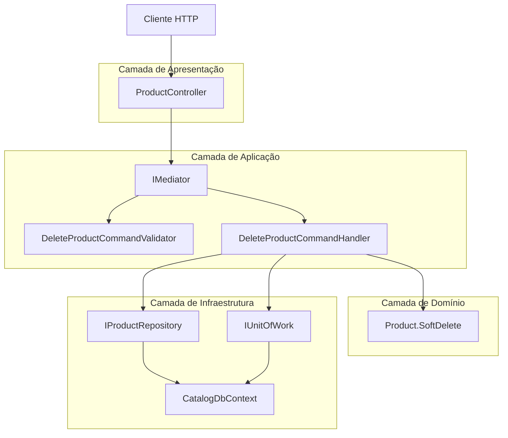
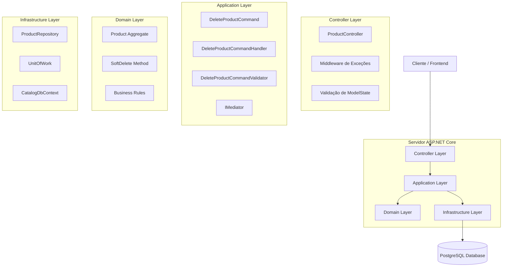
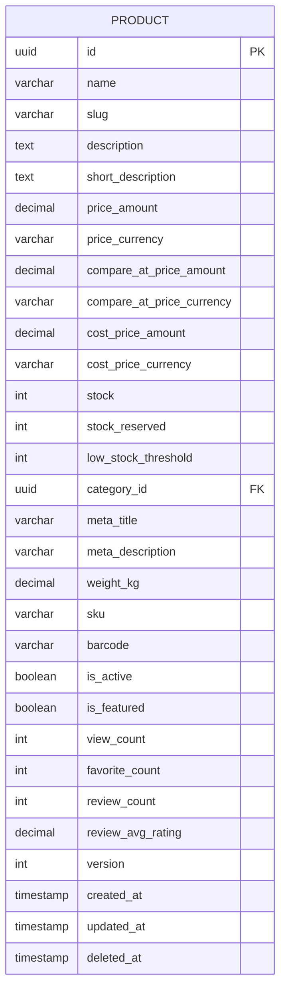

# Arquitetura Técnica - Comando DeleteProduct

## 1. Arquitetura de Design



## 2. Descrição da Tecnologia

- **Frontend**: Não aplicável (API REST)
- **Backend**: ASP.NET Core 8 + Entity Framework Core + PostgreSQL
- **Padrões**: Clean Architecture + CQRS + Mediator Pattern
- **Logging**: Microsoft.Extensions.Logging com Serilog
- **Validação**: FluentValidation (via BuildingBlocks.Core)

## 3. Definições de Rotas

| Rota | Propósito |
|------|-----------|
| DELETE /api/products/{id} | Remove um produto (soft delete) |

## 4. Definições de API

### 4.1 API Principal

**Exclusão de produto**
```
DELETE /api/products/{id}
```

**Parâmetros da Requisição:**
| Nome do Parâmetro | Tipo do Parâmetro | Obrigatório | Descrição |
|-------------------|-------------------|-------------|-----------|
| id | Guid (route) | true | ID único do produto a ser removido |

**Resposta:**
| Nome do Parâmetro | Tipo do Parâmetro | Descrição |
|-------------------|-------------------|-----------|
| success | boolean | Status da operação |
| data | boolean | Resultado da exclusão (sempre true em caso de sucesso) |
| message | string | Mensagem descritiva |
| errors | array | Lista de erros (vazia em caso de sucesso) |

**Exemplo de Requisição:**
```http
DELETE /api/products/123e4567-e89b-12d3-a456-426614174000
Content-Type: application/json
```

**Exemplo de Resposta (Sucesso):**
```json
{
  "success": true,
  "data": true,
  "message": "Produto removido com sucesso",
  "errors": []
}
```

**Exemplo de Resposta (Produto não encontrado):**
```json
{
  "success": false,
  "data": false,
  "message": "Produto com ID 123e4567-e89b-12d3-a456-426614174000 não foi encontrado",
  "errors": [
    {
      "code": "PRODUCT_NOT_FOUND",
      "message": "Produto não encontrado"
    }
  ]
}
```

**Exemplo de Resposta (Produto já deletado):**
```json
{
  "success": false,
  "data": false,
  "message": "Produto já foi removido anteriormente",
  "errors": [
    {
      "code": "PRODUCT_ALREADY_DELETED",
      "message": "Produto já foi removido"
    }
  ]
}
```

## 5. Arquitetura do Servidor



## 6. Modelo de Dados

### 6.1 Definição do Modelo de Dados



### 6.2 Linguagem de Definição de Dados

**Tabela Product (products)**
```sql
-- A tabela já existe, apenas documentando a coluna relevante para soft delete
-- Coluna para soft delete
ALTER TABLE products 
ADD COLUMN IF NOT EXISTS deleted_at TIMESTAMP WITH TIME ZONE NULL;

-- Índice para otimizar consultas que filtram produtos não deletados
CREATE INDEX IF NOT EXISTS idx_products_deleted_at 
ON products(deleted_at) 
WHERE deleted_at IS NULL;

-- Índice composto para consultas comuns
CREATE INDEX IF NOT EXISTS idx_products_active_not_deleted 
ON products(is_active, deleted_at) 
WHERE deleted_at IS NULL;

-- Constraint para garantir que produtos deletados não sejam ativos
ALTER TABLE products 
ADD CONSTRAINT chk_deleted_products_not_active 
CHECK (deleted_at IS NULL OR is_active = false);
```

**Dados de Exemplo para Teste:**
```sql
-- Inserir produto de teste para exclusão
INSERT INTO products (
    id, name, slug, price_amount, price_currency, stock, 
    is_active, is_featured, version, created_at, updated_at
) VALUES (
    '123e4567-e89b-12d3-a456-426614174000',
    'Produto Teste para Exclusão',
    'produto-teste-exclusao',
    99.99,
    'BRL',
    10,
    true,
    false,
    1,
    NOW(),
    NOW()
);

-- Inserir produto já deletado para teste
INSERT INTO products (
    id, name, slug, price_amount, price_currency, stock, 
    is_active, is_featured, version, created_at, updated_at, deleted_at
) VALUES (
    '456e7890-e89b-12d3-a456-426614174001',
    'Produto Já Deletado',
    'produto-ja-deletado',
    149.99,
    'BRL',
    0,
    false,
    false,
    2,
    NOW() - INTERVAL '1 day',
    NOW() - INTERVAL '1 hour',
    NOW() - INTERVAL '1 hour'
);
```

## 7. Configurações de Segurança

### 7.1 Autenticação e Autorização
```csharp
// Configuração no Program.cs ou Startup.cs
services.AddAuthentication(JwtBearerDefaults.AuthenticationScheme)
    .AddJwtBearer(options => {
        // Configurações JWT
    });

services.AddAuthorization(options => {
    options.AddPolicy("AdminOnly", policy => 
        policy.RequireRole("Admin", "Manager"));
});
```

### 7.2 Endpoint com Autorização
```csharp
[HttpDelete("{id:guid}")]
[Authorize(Policy = "AdminOnly")] // Apenas admins podem deletar produtos
public async Task<IActionResult> DeleteProduct([FromRoute] Guid id, CancellationToken cancellationToken = default)
{
    // Implementação
}
```

## 8. Monitoramento e Observabilidade

### 8.1 Métricas Recomendadas
- Número de produtos deletados por período
- Tempo de resposta do endpoint DELETE
- Taxa de erro por tipo (404, 409, 500)
- Produtos restaurados após soft delete

### 8.2 Logs Estruturados
```csharp
// Configuração de logging estruturado
services.AddLogging(builder => {
    builder.AddSerilog(new LoggerConfiguration()
        .WriteTo.Console(new JsonFormatter())
        .WriteTo.File("logs/catalog-service-.txt", 
            rollingInterval: RollingInterval.Day,
            outputTemplate: "{Timestamp:yyyy-MM-dd HH:mm:ss} [{Level:u3}] {Message:lj} {Properties:j}{NewLine}{Exception}")
        .CreateLogger());
});
```

## 9. Configurações de Performance

### 9.1 Otimizações de Banco de Dados
```sql
-- Índices para otimizar consultas de produtos não deletados
CREATE INDEX CONCURRENTLY IF NOT EXISTS idx_products_not_deleted_active 
ON products(id, is_active) 
WHERE deleted_at IS NULL;

-- Estatísticas para otimizador de consultas
ANALYZE products;
```

### 9.2 Cache Strategy
```csharp
// Invalidar cache após soft delete
public async Task<ApiResponse<bool>> HandleAsync(DeleteProductCommand request, CancellationToken cancellationToken = default)
{
    // ... lógica de soft delete ...
    
    // Invalidar cache
    await _cacheService.RemoveAsync($"product:{request.Id}");
    await _cacheService.RemovePatternAsync("products:*");
    
    return ApiResponse<bool>.Success(true, "Produto removido com sucesso");
}
```

## 10. Testes de Integração

### 10.1 Configuração de Teste
```csharp
[TestClass]
public class DeleteProductIntegrationTests : IntegrationTestBase
{
    [TestMethod]
    public async Task DeleteProduct_ValidId_ShouldReturnSuccess()
    {
        // Arrange
        var productId = await CreateTestProductAsync();
        
        // Act
        var response = await Client.DeleteAsync($"/api/products/{productId}");
        
        // Assert
        response.StatusCode.Should().Be(HttpStatusCode.OK);
        var result = await response.Content.ReadFromJsonAsync<ApiResponse<bool>>();
        result.Success.Should().BeTrue();
        result.Data.Should().BeTrue();
    }
}
```

## 11. Deployment e Configuração

### 11.1 Variáveis de Ambiente
```bash
# appsettings.Production.json
{
  "ConnectionStrings": {
    "DefaultConnection": "${CATALOG_DB_CONNECTION_STRING}"
  },
  "Logging": {
    "LogLevel": {
      "CatalogService.Application.Commands.Products.DeleteProduct": "Information"
    }
  }
}
```

### 11.2 Health Checks
```csharp
// Adicionar health check específico para operações de produto
services.AddHealthChecks()
    .AddDbContextCheck<CatalogDbContext>("catalog-db")
    .AddCheck<ProductOperationsHealthCheck>("product-operations");
```