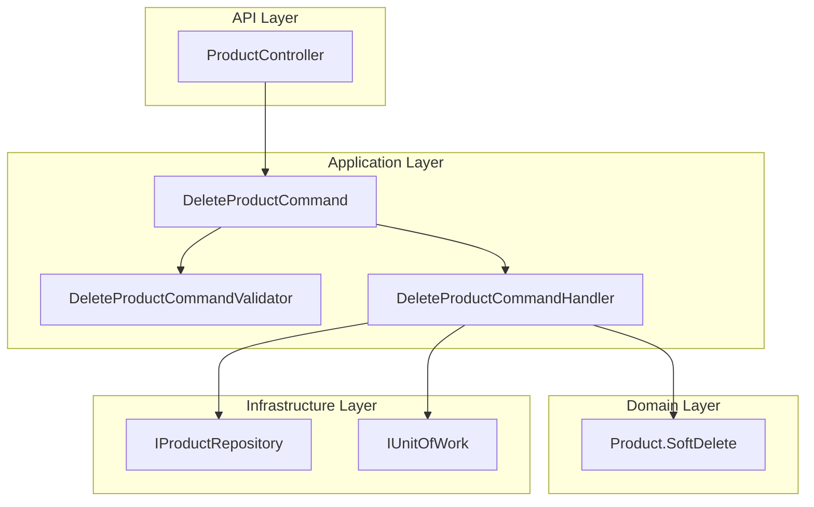

# Especificação Técnica - Comando DeleteProduct

## 1. Visão Geral do Projeto

O projeto **Catalog Service** é um microserviço responsável pelo gerenciamento de produtos e categorias em uma arquitetura de e-commerce. Utiliza os padrões **Clean Architecture** e **CQRS** com as seguintes camadas:

- **CatalogService.Api**: Camada de apresentação com controllers REST
- **CatalogService.Application**: Camada de aplicação com commands, queries e handlers
- **CatalogService.Domain**: Camada de domínio com agregados, entidades e value objects
- **CatalogService.Infrastructure**: Camada de infraestrutura com repositórios e contexto EF

## 2. Especificação do Comando DeleteProduct

### 2.1 Requisitos Funcionais

**Descrição**: Realizar soft delete de um produto existente no catálogo.

**Parâmetros de Entrada**:
- `Id` (Guid, obrigatório): Identificador único do produto a ser removido

**Resposta**:
- `ApiResponse<bool>`: Resposta padronizada com resultado booleano

**Validações Obrigatórias**:
1. **Produto deve existir**: Verificar se o produto com o ID fornecido existe no banco de dados
2. **Não pode ter pedidos pendentes**: Validar se o produto não possui pedidos em andamento (por enquanto, assumir que não há integração com Order Service)
3. **Produto não pode já estar deletado**: Verificar se `DeletedAt` é null

### 2.2 Comportamento Esperado

**Soft Delete**: O produto não será removido fisicamente do banco de dados. Será definida a propriedade `DeletedAt` com a data/hora atual.

**Versionamento**: Incrementar a propriedade `Version` do produto.

**Auditoria**: Atualizar a propriedade `UpdatedAt` com a data/hora atual.

## 3. Arquitetura da Implementação

### 3.1 Componentes a Implementar



### 3.2 Fluxo de Execução

1. **Controller** recebe requisição HTTP DELETE `/api/products/{id}`
2. **Validator** valida o comando (ID não vazio)
3. **Handler** executa a lógica de negócio:
   - Busca o produto pelo ID
   - Verifica se existe e não está deletado
   - Valida se não há pedidos pendentes
   - Chama método `SoftDelete()` da entidade
   - Persiste as alterações via UnitOfWork
4. **Resposta** retorna `ApiResponse<bool>` com sucesso

## 4. Implementação Detalhada

### 4.1 DeleteProductCommand

```csharp
using BuildingBlocks.Core.Responses;
using BuildingBlocks.CQRS.Commands;

namespace CatalogService.Application.Commands.Products.DeleteProduct;

public class DeleteProductCommand : ICommand<ApiResponse<bool>>
{
    public Guid Id { get; set; }
}
```

### 4.2 DeleteProductCommandValidator

```csharp
using BuildingBlocks.Core.Validations;
using BuildingBlocks.CQRS.Validations;

namespace CatalogService.Application.Commands.Products.DeleteProduct;

public class DeleteProductCommandValidator : IValidator<DeleteProductCommand>
{
    public ValidationHandler Validate(DeleteProductCommand request)
    {
        var handler = new ValidationHandler();

        // Validar ID
        if (request.Id == Guid.Empty)
            handler.Add("ID do produto é obrigatório");

        return handler;
    }
}
```

### 4.3 DeleteProductCommandHandler

```csharp
using BuildingBlocks.Core.Data;
using BuildingBlocks.Core.Exceptions;
using BuildingBlocks.Core.Responses;
using BuildingBlocks.CQRS.Commands;
using CatalogService.Domain.Repository;
using Microsoft.Extensions.Logging;

namespace CatalogService.Application.Commands.Products.DeleteProduct;

public class DeleteProductCommandHandler : ICommandHandler<DeleteProductCommand, ApiResponse<bool>>
{
    private readonly IProductRepository _productRepository;
    private readonly IUnitOfWork _unitOfWork;
    private readonly ILogger<DeleteProductCommandHandler> _logger;

    public DeleteProductCommandHandler(
        IProductRepository productRepository,
        IUnitOfWork unitOfWork,
        ILogger<DeleteProductCommandHandler> logger)
    {
        _productRepository = productRepository ?? throw new ArgumentNullException(nameof(productRepository));
        _unitOfWork = unitOfWork ?? throw new ArgumentNullException(nameof(unitOfWork));
        _logger = logger ?? throw new ArgumentNullException(nameof(logger));
    }

    public async Task<ApiResponse<bool>> HandleAsync(DeleteProductCommand request, CancellationToken cancellationToken = default)
    {
        _logger.LogInformation("➡️ [DeleteProductCommandHandler] Iniciando exclusão do produto {ProductId}", request.Id);

        try
        {
            // Buscar produto
            var product = await _productRepository.GetByIdAsync(request.Id, cancellationToken);
            
            if (product == null)
            {
                _logger.LogWarning("❌ [DeleteProductCommandHandler] Produto {ProductId} não encontrado", request.Id);
                throw new NotFoundException($"Produto com ID {request.Id} não foi encontrado");
            }

            // Verificar se já está deletado
            if (product.DeletedAt.HasValue)
            {
                _logger.LogWarning("❌ [DeleteProductCommandHandler] Produto {ProductId} já foi deletado em {DeletedAt}", 
                    request.Id, product.DeletedAt);
                throw new BusinessException("Produto já foi removido anteriormente");
            }

            // TODO: Validar se não há pedidos pendentes
            // Por enquanto, assumir que não há integração com Order Service

            // Realizar soft delete
            product.SoftDelete();

            // Persistir alterações
            await _unitOfWork.SaveChangesAsync(cancellationToken);

            _logger.LogInformation("✅ [DeleteProductCommandHandler] Produto {ProductId} excluído com sucesso", request.Id);

            return ApiResponse<bool>.Success(true, "Produto removido com sucesso");
        }
        catch (Exception ex) when (!(ex is NotFoundException || ex is BusinessException))
        {
            _logger.LogError(ex, "❌ [DeleteProductCommandHandler] Erro ao excluir produto {ProductId}", request.Id);
            throw;
        }
    }
}
```

### 4.4 Método SoftDelete na Entidade Product

```csharp
/// <summary>
/// Realiza o soft delete do produto
/// </summary>
/// <returns>Produto com soft delete aplicado</returns>
public Product SoftDelete()
{
    DeletedAt = DateTime.UtcNow;
    UpdatedAt = DateTime.UtcNow;
    Version++;
    
    return this;
}
```

### 4.5 Endpoint no ProductController

```csharp
/// <summary>
/// Remove um produto (soft delete)
/// </summary>
/// <param name="id">ID do produto a ser removido</param>
/// <param name="cancellationToken">Token de cancelamento</param>
/// <returns>Resultado da operação</returns>
/// <response code="200">Produto removido com sucesso</response>
/// <response code="400">Dados inválidos ou erro de validação</response>
/// <response code="404">Produto não encontrado</response>
/// <response code="409">Produto já foi removido</response>
/// <response code="500">Erro interno do servidor</response>
[HttpDelete("{id:guid}")]
[ProducesResponseType(typeof(ApiResponse<bool>), StatusCodes.Status200OK)]
[ProducesResponseType(typeof(ApiResponse<bool>), StatusCodes.Status400BadRequest)]
[ProducesResponseType(typeof(ApiResponse<bool>), StatusCodes.Status404NotFound)]
[ProducesResponseType(typeof(ApiResponse<bool>), StatusCodes.Status409Conflict)]
[ProducesResponseType(typeof(ApiResponse<bool>), StatusCodes.Status500InternalServerError)]
public async Task<IActionResult> DeleteProduct([FromRoute] Guid id, CancellationToken cancellationToken = default)
{
    _logger.LogInformation("➡️ [ProductController] Iniciando exclusão para DeleteProductCommand com ID {ProductId}", id);

    var command = new DeleteProductCommand { Id = id };

    // Enviar command via Mediator
    var result = await _mediator.SendAsync<ApiResponse<bool>>(command, cancellationToken);

    _logger.LogInformation("✅ [ProductController] Operação concluída com sucesso para DeleteProductCommand com ID {ProductId}", id);
    
    return Ok(result);
}
```

## 5. Tratamento de Erros

### 5.1 Cenários de Erro

| Cenário | Exceção | Status HTTP | Mensagem |
|---------|---------|-------------|----------|
| ID vazio/inválido | ValidationException | 400 | "ID do produto é obrigatório" |
| Produto não encontrado | NotFoundException | 404 | "Produto com ID {id} não foi encontrado" |
| Produto já deletado | BusinessException | 409 | "Produto já foi removido anteriormente" |
| Produto com pedidos pendentes | BusinessException | 409 | "Não é possível remover produto com pedidos pendentes" |
| Erro interno | Exception | 500 | "Erro interno do servidor" |

### 5.2 Logs Estruturados

- **Início**: `➡️ [DeleteProductCommandHandler] Iniciando exclusão do produto {ProductId}`
- **Produto não encontrado**: `❌ [DeleteProductCommandHandler] Produto {ProductId} não encontrado`
- **Produto já deletado**: `❌ [DeleteProductCommandHandler] Produto {ProductId} já foi deletado em {DeletedAt}`
- **Sucesso**: `✅ [DeleteProductCommandHandler] Produto {ProductId} excluído com sucesso`
- **Erro**: `❌ [DeleteProductCommandHandler] Erro ao excluir produto {ProductId}`

## 6. Testes Recomendados

### 6.1 Cenários de Teste

1. **Teste de Sucesso**: Deletar produto existente e ativo
2. **Teste de Validação**: ID vazio ou inválido
3. **Teste de Não Encontrado**: Produto inexistente
4. **Teste de Já Deletado**: Produto já removido anteriormente
5. **Teste de Integração**: Verificar persistência no banco
6. **Teste de Performance**: Tempo de resposta adequado

### 6.2 Dados de Teste

```json
{
  "cenario_sucesso": {
    "id": "123e4567-e89b-12d3-a456-426614174000",
    "expected_status": 200,
    "expected_response": {
      "success": true,
      "data": true,
      "message": "Produto removido com sucesso"
    }
  },
  "cenario_nao_encontrado": {
    "id": "999e4567-e89b-12d3-a456-426614174999",
    "expected_status": 404,
    "expected_message": "Produto com ID 999e4567-e89b-12d3-a456-426614174999 não foi encontrado"
  }
}
```

## 7. Considerações de Segurança

1. **Autorização**: Implementar verificação de permissões (admin/manager)
2. **Auditoria**: Registrar quem executou a operação
3. **Rate Limiting**: Limitar número de exclusões por período
4. **Validação de Entrada**: Sanitizar e validar o ID fornecido

## 8. Melhorias Futuras

1. **Integração com Order Service**: Validar pedidos pendentes via API
2. **Soft Delete Reverso**: Implementar comando para restaurar produtos
3. **Exclusão em Lote**: Permitir deletar múltiplos produtos
4. **Notificações**: Enviar eventos para outros serviços
5. **Cache**: Invalidar cache de produtos após exclusão

## 9. Conformidade com Padrões

### 9.1 Clean Architecture
- ✅ Separação clara de responsabilidades
- ✅ Dependências apontam para dentro
- ✅ Regras de negócio no domínio

### 9.2 CQRS
- ✅ Comando separado de query
- ✅ Handler específico para o comando
- ✅ Validação independente

### 9.3 Padrões do Projeto
- ✅ Logs estruturados com emojis
- ✅ Tratamento de exceções padronizado
- ✅ Resposta ApiResponse consistente
- ✅ Versionamento de entidades
- ✅ Soft delete com auditoria