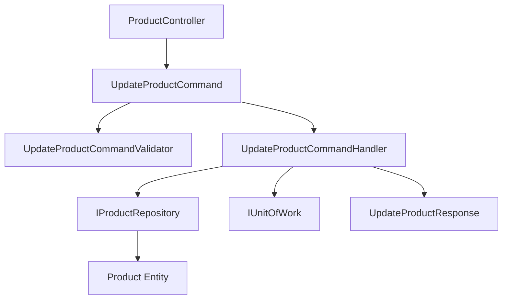

# Especificação Técnica - Comando UpdateProduct

## 1. Visão Geral

O comando `UpdateProduct` permite atualizar informações de um produto existente no sistema de catálogo, seguindo os padrões de Clean Architecture e CQRS estabelecidos no projeto.

## 2. Arquitetura

### 2.1 Diagrama de Arquitetura



### 2.2 Componentes

| Componente | Responsabilidade |
|------------|------------------|
| UpdateProductCommand | Define os parâmetros de entrada para atualização |
| UpdateProductCommandValidator | Valida os dados de entrada |
| UpdateProductCommandHandler | Implementa a lógica de negócio |
| UpdateProductResponse | Define a resposta da operação |
| ProductController | Endpoint HTTP PUT |

## 3. Especificação do Comando

### 3.1 UpdateProductCommand

```csharp
public class UpdateProductCommand : ICommand<ApiResponse<UpdateProductResponse>>
{
    public Guid Id { get; set; }
    public string Name { get; set; } = string.Empty;
    public string Slug { get; set; } = string.Empty;
    public string? Description { get; set; }
    public string? ShortDescription { get; set; }
    
    // Pricing
    public decimal Price { get; set; }
    public string Currency { get; set; } = "BRL";
    public decimal? CompareAtPrice { get; set; }
    public decimal? CostPrice { get; set; }
    
    // Inventory
    public int Stock { get; set; }
    public int LowStockThreshold { get; set; } = 10;
    
    // Categorization
    public Guid? CategoryId { get; set; }
    
    // SEO
    public string? MetaTitle { get; set; }
    public string? MetaDescription { get; set; }
    
    // Attributes
    public decimal? WeightKg { get; set; }
    public string? Sku { get; set; }
    public string? Barcode { get; set; }
    
    // Status
    public bool IsActive { get; set; } = true;
    public bool IsFeatured { get; set; } = false;
}
```

### 3.2 Validações

| Campo | Validação |
|-------|-----------|
| Id | Obrigatório, deve ser um GUID válido |
| Name | Obrigatório, máximo 200 caracteres |
| Slug | Obrigatório, formato válido, máximo 200 caracteres, único |
| Description | Opcional, máximo 2000 caracteres |
| ShortDescription | Opcional, máximo 500 caracteres |
| Price | Obrigatório, maior que zero |
| Currency | Obrigatório, formato válido |
| CompareAtPrice | Opcional, deve ser maior que Price |
| CostPrice | Opcional, maior que zero |
| Stock | Maior ou igual a zero |
| LowStockThreshold | Maior ou igual a zero |
| MetaTitle | Opcional, máximo 60 caracteres |
| MetaDescription | Opcional, máximo 160 caracteres |
| WeightKg | Opcional, maior que zero |
| Sku | Opcional, máximo 50 caracteres |
| Barcode | Opcional, máximo 50 caracteres |

### 3.3 Regras de Negócio

1. **Produto deve existir**: Verificar se o produto com o ID fornecido existe
2. **Slug único**: Verificar se o slug não está sendo usado por outro produto
3. **Categoria válida**: Se CategoryId for fornecido, deve existir
4. **Preços consistentes**: CompareAtPrice deve ser maior que Price
5. **Soft delete**: Não permitir atualização de produtos excluídos

## 4. Implementação

### 4.1 Método Update na Entidade Product

```csharp
public Product Update(
    string name,
    string slug,
    Money price,
    int stock,
    string? description = null,
    string? shortDescription = null,
    Money? compareAtPrice = null,
    Money? costPrice = null,
    int lowStockThreshold = 10,
    Guid? categoryId = null,
    string? metaTitle = null,
    string? metaDescription = null,
    decimal? weightKg = null,
    string? sku = null,
    string? barcode = null,
    bool isActive = true,
    bool isFeatured = false)
{
    Name = name;
    Slug = slug;
    Description = description;
    ShortDescription = shortDescription;
    Price = price;
    CompareAtPrice = compareAtPrice;
    CostPrice = costPrice;
    Stock = stock;
    LowStockThreshold = lowStockThreshold;
    CategoryId = categoryId;
    MetaTitle = metaTitle;
    MetaDescription = metaDescription;
    WeightKg = weightKg;
    Sku = sku;
    Barcode = barcode;
    IsActive = isActive;
    IsFeatured = isFeatured;
    UpdatedAt = DateTime.UtcNow;
    Version++;
    
    return this;
}
```

### 4.2 Handler Logic

1. **Validação de entrada**: Usar UpdateProductCommandValidator
2. **Buscar produto**: Verificar se existe e não está excluído
3. **Validar slug único**: Verificar conflitos com outros produtos
4. **Criar objetos Money**: Para preços monetários
5. **Atualizar produto**: Usar método Update da entidade
6. **Persistir mudanças**: Via UnitOfWork
7. **Retornar resposta**: UpdateProductResponse

### 4.3 Endpoint HTTP

```csharp
[HttpPut("{id:guid}")]
[ProducesResponseType(typeof(ApiResponse<UpdateProductResponse>), StatusCodes.Status200OK)]
[ProducesResponseType(typeof(ApiResponse<UpdateProductResponse>), StatusCodes.Status400BadRequest)]
[ProducesResponseType(typeof(ApiResponse<UpdateProductResponse>), StatusCodes.Status404NotFound)]
[ProducesResponseType(typeof(ApiResponse<UpdateProductResponse>), StatusCodes.Status409Conflict)]
[ProducesResponseType(typeof(ApiResponse<UpdateProductResponse>), StatusCodes.Status500InternalServerError)]
public async Task<IActionResult> UpdateProduct(
    [FromRoute] Guid id, 
    [FromBody] UpdateProductCommand command, 
    CancellationToken cancellationToken = default)
```

## 5. Tratamento de Erros

| Cenário | Status Code | Resposta |
|---------|-------------|----------|
| Dados inválidos | 400 | ValidationException |
| Produto não encontrado | 404 | NotFoundException |
| Slug duplicado | 409 | ConflictException |
| Erro interno | 500 | InternalServerException |

## 6. Logs Padronizados

- **Início**: `"➡️ [UpdateProductCommandHandler] Iniciando atualização do produto {ProductId}"`
- **Sucesso**: `"✅ [UpdateProductCommandHandler] Produto {ProductId} atualizado com sucesso"`
- **Erro**: `"❌ [UpdateProductCommandHandler] Erro ao atualizar produto {ProductId}: {Error}"`

## 7. Resposta

```csharp
public record UpdateProductResponse(
    Guid Id,
    string Name,
    string Slug,
    string? Description,
    string? ShortDescription,
    decimal Price,
    string Currency,
    decimal? CompareAtPrice,
    decimal? CostPrice,
    int Stock,
    int LowStockThreshold,
    Guid? CategoryId,
    string? MetaTitle,
    string? MetaDescription,
    decimal? WeightKg,
    string? Sku,
    string? Barcode,
    bool IsActive,
    bool IsFeatured,
    int Version,
    DateTime CreatedAt,
    DateTime UpdatedAt
);
```

## 8. Testes Recomendados

### 8.1 Cenários de Sucesso
- Atualizar produto com dados válidos
- Atualizar apenas campos obrigatórios
- Atualizar com preços opcionais

### 8.2 Cenários de Erro
- Produto inexistente
- Slug duplicado
- Dados inválidos
- Preços inconsistentes

## 9. Considerações de Performance

- **Índices**: Garantir índices em Slug e CategoryId
- **Validação de slug**: Usar query otimizada para verificar duplicatas
- **Transações**: Usar UnitOfWork para consistência
- **Logs**: Incluir ProductId para rastreabilidade